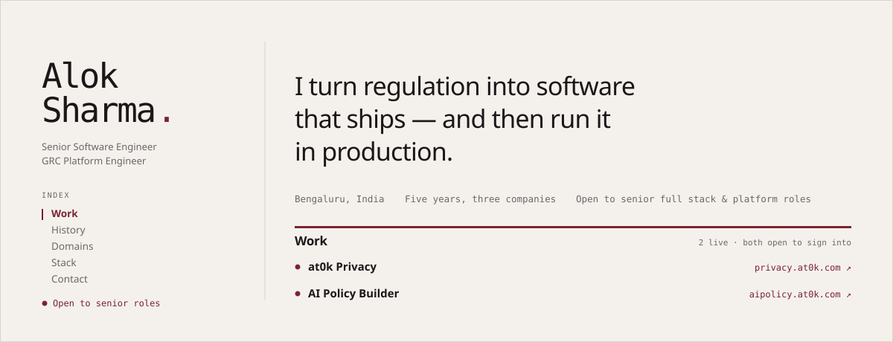

<picture>
  <source media="(prefers-color-scheme: dark)" srcset="assets/masthead-dark.svg">
  
</picture>

Five years, three companies. I build multi-tenant compliance platforms: consent management under India's DPDP Act, AI-assisted policy generation, risk registers, audit trails. The part I'm actually good at is the translation — reading a statute or a control framework and coming back with a data model, a workflow and an audit trail that an assessor will accept.

**Open to senior full stack & platform roles.** &nbsp;·&nbsp; [at0k.com](https://at0k.com) &nbsp;·&nbsp; [thakuralok99@gmail.com](mailto:thakuralok99@gmail.com)

---

## Work

<sub>**2 LIVE · BOTH OPEN TO SIGN INTO**</sub>

Rather than ask you to email me for a walkthrough, here is the credential — one pair opens both systems. Seeded demo tenants; nothing real behind them.

```
email     demouser@at0k.com
password  demo@r00t
```

### ● [at0k Privacy](https://privacy.at0k.com)

**Multi-jurisdiction privacy compliance, DPDP live**

Privacy operations platform built around India's DPDP Act, with field schemas drafted for GDPR, CCPA, PIPEDA, POPIA, PDPA, PDPL and DORA — a law-config engine activates the same modules per jurisdiction.

Every consent record pins an immutable SHA-256 snapshot of the form that captured it, so the append-only audit trail can replay any agreement exactly as it was given: purposes, notice text and all. That is the whole point of the product — a consent you cannot reconstruct is a consent you cannot defend.

Also covers data inventory and ROPA, DPIA, vendor and breach management, and data subject requests with evidence attachments. Ships an embeddable JavaScript consent SDK — bcrypt-hashed API keys, origin allow-listing, anonymous-visitor capture with post-login identity merge, Global Privacy Control — alongside a public DSR intake, email OTP sign-in and per-tenant isolation throughout.

`25 backend modules` &nbsp; `7 jurisdictions schema-drafted` &nbsp; `~900 passing tests`

<sub>FastAPI · Next.js 14 · TypeScript · PostgreSQL 16 · SQLAlchemy 2 · Celery · Redis · Docker</sub>

### ● [AI Policy Builder](https://aipolicy.at0k.com)

**AI-generated compliance policies, end to end**

Multi-tenant SaaS that generates compliance policies with AI, then maps them to framework controls, runs gap analysis, and produces evidence requirements.

Async generation pipeline with job polling, per-plan token budgets, per-org rate limiting, bring-your-own-key providers through LiteLLM with encrypted key storage, and PDF/Markdown export. Policies are drafted in a real-time collaborative editor — a Tiptap core over a Hocuspocus server teams host themselves — gated by a separately deployed licensing service issuing Ed25519-signed license JWTs with heartbeat reporting and revocation.

Auth on AWS Cognito, Stripe subscription billing, self-hosted on GCP behind Nginx with Let's Encrypt and Cloudflare.

`4 frameworks` &nbsp; `212 controls catalogued` &nbsp; `24 canonical policies`

<sub>FastAPI · React · TypeScript · Celery · MySQL · Redis · Cognito · LiteLLM · Tiptap · Hocuspocus · Stripe</sub>

### ○ PurpleCop

**Multi-tenant enterprise GRC & cybersecurity platform**

Technical lead and core developer on a 10-module GRC platform. Shipped policy automation, risk register, TPRM, DPDP compliance, LMS, trust center, document management, compliance scoring and audit management — plus continuous compliance monitoring that pulls configuration from AWS, GCP, Salesforce, Zoho and HRMS platforms to evaluate controls.

`10 modules` &nbsp; `5 cloud integrations`

<sub>Laravel · React · PostgreSQL · Docker · CI/CD</sub>

### ○ Commercial LMS platforms

**Course sales and student learning, in production**

Customer-facing learning platforms covering course management, student enrollment, authentication, payment workflows, progress tracking, assessments and certification.

<sub>Laravel · React · MySQL · Payments</sub>

---

## History

<sub>**2020 — PRESENT**</sub>

| | | |
| --- | --- | --- |
| `Apr 2025 – Jul 2026` | **Senior Software Engineer** | Purplecop Security Pvt. Ltd |
| `Feb 2023 – Mar 2025` | **Senior Web Developer** | Froximo Technology Pvt. Ltd |
| `Nov 2020 – Oct 2022` | **Junior Web Developer** | Softechpark Pvt. Ltd |

---

## Domains

<sub>**WHAT SURVIVES A CHANGE OF STACK**</sub>

| | |
| --- | --- |
| **GRC & compliance** | Multi-tenant enterprise GRC, cybersecurity platforms, continuous compliance monitoring, compliance scoring |
| **Compliance frameworks** | GDPR, ISO 27001, SOC 2, DPDP Act 2023, HIPAA, NIST CSF |
| **Product domains** | Policy automation, consent management, DSR workflows, TPRM, risk register, audit management, trust center, LMS, compliance gap analysis |
| **AI & automation** | Generative policy drafting, AI-assisted compliance, automated control mapping, LLM integration, multi-provider orchestration |
| **Architecture patterns** | Multi-tenant SaaS, RBAC & access control, append-only audit trails, event-driven systems, real-time collaboration, Docker-based deployments |
| **Regulatory translation** | Requirements → technical specifications, framework mapping, control implementation, evidence-based compliance tracking |

---

## Stack

<sub>**TOOLS, NOT JUDGMENT**</sub>

| | |
| --- | --- |
| **Backend** | Python, FastAPI, Laravel, Node.js, Flask, PHP |
| **Frontend** | React.js, Next.js, TypeScript, Redux, Tailwind CSS, ChakraUI |
| **Databases** | PostgreSQL, MySQL, MongoDB, Firebase, Redis |
| **DevOps** | Docker, Nginx, Ubuntu Server, SSL/TLS, CI/CD, Proxmox |

---

## Contact

<sub>**REPLIES WITHIN A DAY**</sub>

| | |
| --- | --- |
| **Email** | [thakuralok99@gmail.com](mailto:thakuralok99@gmail.com) |
| **Site** | [at0k.com](https://at0k.com) |
| **Phone** | [+91-9288389180](tel:+919288389180) |
| **Education** | B.Tech in Information Technology — Sona College of Technology, Anna University, 2019 |

<sub>at0k.com · Built and hosted by me, like everything else here.</sub>
